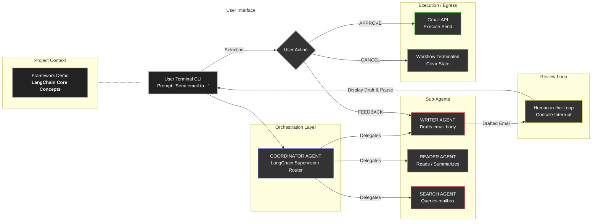

# Multi-Agent Gmail Assistant (LangChain Demonstration)

A hands-on project built to explore and demonstrate the core capabilities of the **LangChain** framework. This application automates reading, searching, and drafting emails via the Gmail API while showcasing a practical implementation of the supervisor/worker orchestration pattern and a custom Human-in-the-Loop (HITL) approval workflow.

---

# 🏗️ System Architecture & Logic Flow

The flowchart below illustrates how the application routes requests through a central LangChain supervisor before pausing for explicit user confirmation prior to executing outbound email actions.



---

# 📂 Repository Structure

```text id="jlwm3r"
├── agents.py
│   └── Sub-agents, supervisor routing, and terminal HITL workflow
│
├── auth.py
│   └── Gmail API OAuth initialization and tool loading
│
├── main.py
│   └── Main application entry point and interactive CLI loop
│
├── prompts.py
│   └── System prompts defining individual agent behavior
│
└── requirements.txt
    └── Core project dependencies
```

---

# ⚙️ Core Concepts Demonstrated

## Supervisor Pattern

Demonstrates how a central LangChain orchestration agent can:

* Parse user intent
* Delegate execution
* Coordinate specialized worker agents
* Maintain workflow control

---

## Tool Integration

Connects LLM-driven agents directly to external Gmail tools for:

* Reading emails
* Searching mailboxes
* Drafting email responses
* Staging outbound actions

---

## Human-in-the-Loop (HITL)

Implements a conditional terminal approval workflow that intercepts high-impact actions such as:

```python id="ecw95p"
send_gmail_message
```

Before execution, the system:

1. Prints the drafted email
2. Pauses execution
3. Requires explicit user approval

Available actions:

* APPROVE
* CANCEL
* FEEDBACK / REVISE

---

# 🚀 How to Run Locally

## Prerequisites

* Python 3.10+
* Google Cloud Project
* Gmail API enabled
* OAuth Desktop credentials configured

---

# ⚙️ Installation

## 1. Clone the Repository

```bash id="hmv4a8"
git clone https://github.com/yourusername/your-repository-name.git

cd your-repository-name
```

---

## 2. Install Dependencies

```bash id="4v5nxa"
pip install -r requirements.txt
```

---

## 3. Create a `.env` File

```env id="jlwmqj"
GEMINI_API_KEY=your_gemini_api_key
```

---

## 4. Add OAuth Credentials

Place your Google Cloud OAuth Desktop credentials file in the root directory and rename it to:

```text id="0af40r"
credentials.json
```

---

## 5. Run the Application

```bash id="m8hkn7"
python main.py
```

---

# 🔐 First-Time Authentication

On the first launch:

1. A browser window opens automatically
2. Sign into your Google account
3. Approve Gmail API permissions
4. A local `token.json` file is generated for persistent authentication

---

# 🧠 Technologies Used

* LangChain
* Gmail API
* Google OAuth 2.0
* Gemini API
* Python

---

# 📌 Project Purpose

This repository was built as a practical learning project to explore:

* Multi-agent orchestration
* Tool-calling workflows
* LLM supervision patterns
* Safe external system interaction
* Human approval loops

The focus is educational and architectural rather than production deployment.

---

# 📜 License

This project is intended for:

* Educational purposes
* Research
* LangChain experimentation
* Multi-agent workflow demonstrations

Use responsibly and comply with Google's API Terms of Service.
