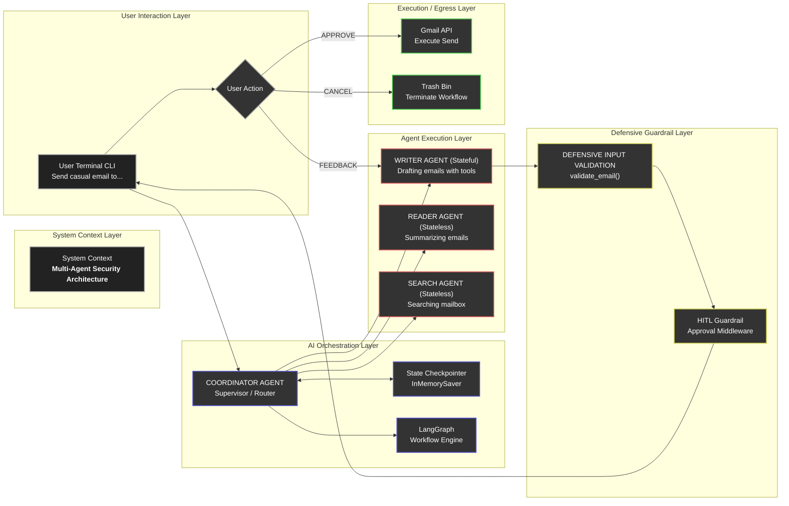

# Secure Multi-Agent Gmail Assistant

A powerful multi-agent email orchestration system built using **LangChain** and **LangGraph**. This project automates reading, searching, and drafting emails via the Gmail API while enforcing a security-first architecture with strict Human-in-the-Loop (HITL) safeguards.

---

# 🏗️ System Architecture & Program Flow

The flowchart below represents the complete logical execution path — from user input to zero-trust email approval and final Gmail execution.



---

# 📂 Repository Structure

```text
├── agents.py
│   └── Multi-agent definitions, coordinator routing, HITL wrapper logic
│
├── auth.py
│   └── Gmail API OAuth initialization and secure tool partitioning
│
├── main.py
│   └── Main application entry point and CLI interaction loop
│
├── prompts.py
│   └── Isolated system prompts for all agents
│
└── requirements.txt
    └── Python dependency configuration
```

---

# 🛡️ Key Security Features

## Defensive Routing

The `COORDINATOR AGENT` exclusively handles task routing.

* Reader and Search agents are fully stateless
* Read-only operations are sandboxed
* No outbound execution permissions are granted to non-writer agents

This reduces accidental tool misuse and prevents unauthorized state mutations.

---

## Deterministic Validation

Strict Python validation using `email-validator` ensures recipient addresses are syntactically correct before execution.

This acts as a non-LLM defensive layer against hallucinated or malformed recipients.

---

## Zero-Trust Human-in-the-Loop (HITL)

High-risk operations such as:

* `send_gmail_message`

are intercepted before execution.

The workflow pauses and:

1. Displays the generated email
2. Waits for explicit human approval
3. Allows:

   * Approve
   * Cancel
   * Feedback / Redraft

Without explicit approval, execution is discarded safely.

---

# 🚀 How to Run Locally

## Prerequisites

* Python 3.10+
* Google Cloud Project
* Gmail API enabled
* Desktop OAuth credentials configured

---

# ⚙️ Installation

## 1. Clone the Repository

```bash
git clone https://github.com/yourusername/your-repository-name.git

cd your-repository-name
```

---

## 2. Install Dependencies

```bash
pip install -r requirements.txt
```

---

## 3. Create a `.env` File

```env
GEMINI_API_KEY=your_actual_api_key_here
```

---

## 4. Add OAuth Credentials

Place your Google Cloud OAuth Desktop credentials file in the project root directory and rename it to:

```text
credentials.json
```

---

## 5. Run the Application

```bash
python main.py
```

---

# 🔐 First-Time Authentication Flow

On the first run:

1. A browser window opens automatically
2. Sign into your Google account
3. Grant Gmail API permissions
4. A local `token.json` file is generated for persistent authentication

---

# 🧠 Core Technologies

* LangChain
* LangGraph
* Gmail API
* Google OAuth 2.0
* Gemini API
* Python

---

# 📌 Design Philosophy

This project demonstrates a modern **security-first multi-agent architecture** for LLM systems interacting with sensitive infrastructure.

Core principles include:

* Stateless sub-agents
* Tool isolation
* Deterministic validation layers
* Human approval checkpoints
* Zero-trust execution
* Explicit orchestration boundaries

The goal is to showcase how AI systems can safely interface with real-world communication systems while maintaining strong operational safeguards.

---

# 📜 License

This project is intended for:

* Educational purposes
* Research
* Security experimentation
* Multi-agent orchestration learning

Use responsibly and follow Google's API Terms of Service.
